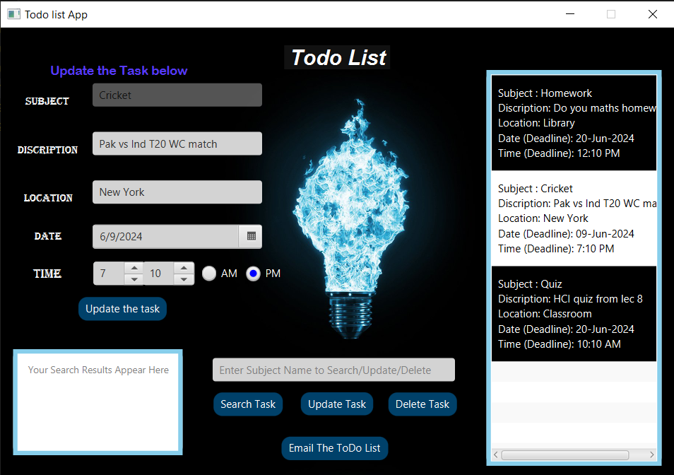
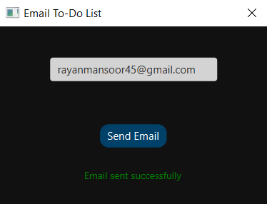

# JavaFX To-Do List Application

A feature-rich desktop to-do list application built with JavaFX and Maven. This application allows users to create, manage, search, update, and delete tasks with deadline tracking. It also includes email functionality to share your to-do list.



## Features

- ✅ **Create Tasks** - Add tasks with subject, description, location, date, and time
- 🔍 **Search Tasks** - Search for tasks by subject name
- ✏️ **Update Tasks** - Modify existing tasks
- 🗑️ **Delete Tasks** - Remove completed or unwanted tasks
- 💾 **Persistent Storage** - Tasks are automatically saved to `database.txt`
- 📧 **Email Integration** - Send your to-do list via email
- 🎨 **Modern UI** - Clean and intuitive user interface with custom styling



## Technologies Used

- **Java** - Core programming language
- **JavaFX** - GUI framework
- **Maven** - Build and dependency management
- **JavaMail API** - Email functionality
- **Java Serialization** - Data persistence
- **Dotenv** - Environment variable management

## Prerequisites

- Java 11 or higher
- Maven 3.6 or higher
- SMTP email credentials (for email functionality)

## Installation

1. **Clone the repository**
```bash
   git clone https://github.com/yourusername/todolist-javafx.git
   cd todolist-javafx
```

2. **Set up environment variables**
   
   Create a `.env` file in the project root directory:
```env
   SMTP_USERNAME=your-email@gmail.com
   SMTP_PASSWORD=your-app-password
   SMTP_HOST=smtp.gmail.com
   SMTP_PORT=465
   SMTP_FROM=your-email@gmail.com
```

   > **Note**: For Gmail, you'll need to generate an [App Password](https://support.google.com/accounts/answer/185833) instead of using your regular password.

3. **Build the project**
```bash
   mvn clean install
```

4. **Run the application**
```bash
   mvn javafx:run
```

## Usage

### Adding a Task

1. Fill in all the required fields:
   - **Subject** - Brief title of the task
   - **Description** - Detailed description
   - **Location** - Where the task needs to be completed
   - **Date** - Deadline date
   - **Time** - Deadline time (with AM/PM)
2. Click **Add Task**
3. The task will appear in the list on the right

### Searching for a Task

1. Enter the task subject in the search field
2. Click **Search Task**
3. The matching task will appear in the search results area

### Updating a Task

1. Enter the task subject in the search field
2. Click **Update Task**
3. The task details will populate the form
4. Modify the fields as needed
5. Click **Update task** to save changes

### Deleting a Task

1. Enter the task subject in the search field
2. Click **Delete Task**
3. The task will be removed from the list

### Emailing Your To-Do List

1. Click **Email The ToDo List**
2. Enter the recipient's email address
3. Click **Send Email**
4. You'll receive a confirmation when the email is sent

## Project Structure
```
todolist-javafx/
├── src/
│   └── main/
│       ├── java/com/mycompany/todolistgui/
│       │   ├── App.java                    # Main application entry point
│       │   ├── PrimaryController.java      # Main UI controller
│       │   ├── SecondaryController.java    # Email dialog controller
│       │   ├── ToDoList.java               # Task model
│       │   ├── ToDoRepository.java         # Data persistence
│       │   ├── EmailService.java           # Email functionality
│       │   └── Env.java                    # Environment variable handler
│       └── resources/com/mycompany/todolistgui/
│           ├── primary.fxml                # Main UI layout
│           ├── secondary.fxml              # Email dialog layout
│           ├── MainStyle.css               # Main UI styles
│           └── style.css                   # Email dialog styles
├── screenshots/
│   ├── togo.png                            # Main interface screenshot
│   └── email.png                           # Email dialog screenshot
├── database.txt                            # Auto-generated task storage
├── .env                                    # Environment variables (not in repo)
├── pom.xml                                 # Maven configuration
└── README.md
```

## Dependencies

The project uses the following key dependencies (managed via Maven):

- JavaFX Controls & FXML
- JavaMail API (`javax.mail`)
- Java Dotenv (`io.github.cdimascio:dotenv-java`)

See `pom.xml` for complete dependency list.

## Data Storage

Tasks are stored locally in `database.txt` using Java serialization. The file is automatically created on first run and updated whenever tasks are added, modified, or deleted.

## Troubleshooting

### Email not sending

- Verify your SMTP credentials in the `.env` file
- For Gmail, ensure you're using an App Password
- Check if less secure app access is enabled (if not using App Passwords)
- Verify port 465 (SSL) or 587 (STARTTLS) is not blocked by your firewall

### Application won't start

- Ensure Java 11+ is installed: `java -version`
- Verify Maven is installed: `mvn -version`
- Try cleaning the build: `mvn clean install`

### Tasks not saving

- Check file permissions in the project directory
- Ensure `database.txt` is not opened in another program

## Contributing

Contributions are welcome! Please feel free to submit a Pull Request.

1. Fork the project
2. Create your feature branch (`git checkout -b feature/AmazingFeature`)
3. Commit your changes (`git commit -m 'Add some AmazingFeature'`)
4. Push to the branch (`git push origin feature/AmazingFeature`)
5. Open a Pull Request

## License

This project is licensed under the MIT License - see below for details:
```
MIT License

Copyright (c) 2025

Permission is hereby granted, free of charge, to any person obtaining a copy
of this software and associated documentation files (the "Software"), to deal
in the Software without restriction, including without limitation the rights
to use, copy, modify, merge, publish, distribute, sublicense, and/or sell
copies of the Software, and to permit persons to whom the Software is
furnished to do so, subject to the following conditions:

The above copyright notice and this permission notice shall be included in all
copies or substantial portions of the Software.

THE SOFTWARE IS PROVIDED "AS IS", WITHOUT WARRANTY OF ANY KIND, EXPRESS OR
IMPLIED, INCLUDING BUT NOT LIMITED TO THE WARRANTIES OF MERCHANTABILITY,
FITNESS FOR A PARTICULAR PURPOSE AND NONINFRINGEMENT. IN NO EVENT SHALL THE
AUTHORS OR COPYRIGHT HOLDERS BE LIABLE FOR ANY CLAIM, DAMAGES OR OTHER
LIABILITY, WHETHER IN AN ACTION OF CONTRACT, TORT OR OTHERWISE, ARISING FROM,
OUT OF OR IN CONNECTION WITH THE SOFTWARE OR THE USE OR OTHER DEALINGS IN THE
SOFTWARE.
```

## Acknowledgments

- JavaFX community for excellent documentation
- JavaMail API for email functionality
- Maven for dependency management

## Contact

For questions or support, please open an issue on the GitHub repository.

---

**Enjoy organizing your tasks! 📝✨**
